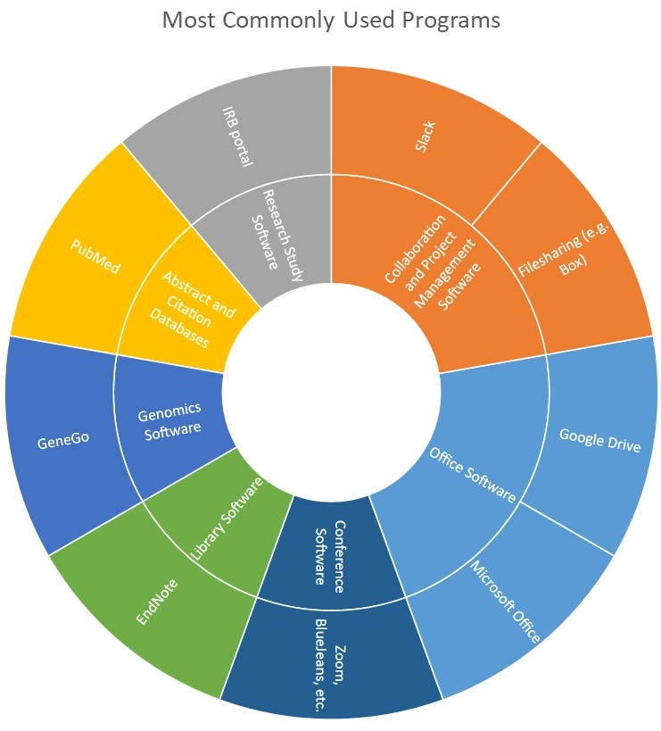

---
### Basic Scientist: Arthur "Art" Rosen
#### Profile

<embed src="https://docs.google.com/viewer?url=https://github.com/data2health/CTS-Personas/raw/master/docs/assets/BasicScientist_PersonaProfile.pdf&embedded=true" style="width:100%; height:700px;" frameborder="0" />
 
Click the icon in the upper right-hand corner, then "Open Original" to download.

#### Software usage

Art’s usage of technology and software can be described as that of the desktop researcher. In his work as a basic scientist he uses PubMed Central to retrieve articles, which he forwards to his assistant, who collects and maintains them in EndNote libraries. He accesses PubMed mainly on his laptop and occasionally on his tablet while commuting. His writing and manuscript review is done on his laptop, sometimes supplemented by work on a home desktop computer.

##### Back to [Profiles](index.md)
