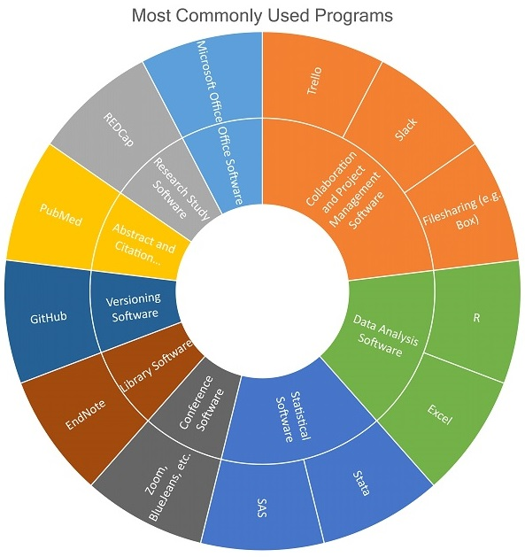

---
### Biostatistician: Lindsay D'Amato
#### Profile

<embed src="https://docs.google.com/viewer?url=https://github.com/data2health/CTS-Personas/raw/master/docs/assets/Biostatistician_PersonaProfile.pdf&embedded=true" style="width:100%; height:700px;" frameborder="0" />
 
Click the icon in the upper right-hand corner, then "Open Original" to download.

#### Software usage

Lindsay’s software usage is highly statistical in nature. For study design and analysis purposes she frequently employs programs like SAS, Stata, R, and occasionally PASS. Lindsay may share and disseminate the results of these analyses in Excel or other formats. She accesses sources like REDCap for project data. Her work is highly collaborative in nature as she works with PIs to complete studies, and she makes frequent use of collaboration tools like the Microsoft Office Suite, Box, Trello, Slack, GitHub, EndNote, and video conferencing software.

##### Back to [Profile](index.md)
