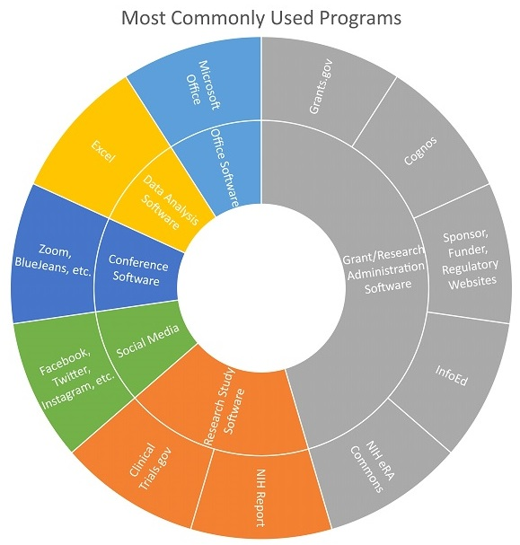

---
### Center Administrator: Carmen Lukovich
#### Profile

<embed src="https://docs.google.com/viewer?url=https://github.com/data2health/CTS-Personas/raw/master/docs/assets/CenterAdministrator_PersonaProfile.pdf&embedded=true" style="width:100%; height:700px;" frameborder="0" />
 
Click the icon in the upper right-hand corner, then "Open Original" to download.

#### Software usage
Carmen uses technology and software as a desktop researcher. She utilized PubMed and EndNote more frequently in her previous career in clinical trials. As a Center Administrator, she most frequently accesses web portals for grant and study management as well as funder, regulatory, financial, and other websites. Reports from the university sponsored research and financial offices are forwarded to her by her assistant, and she frequently uses budgeting software. Tablets and mobile phones are invaluable to her at her speaking engagements.

##### Back to [Profiles](index.md)
