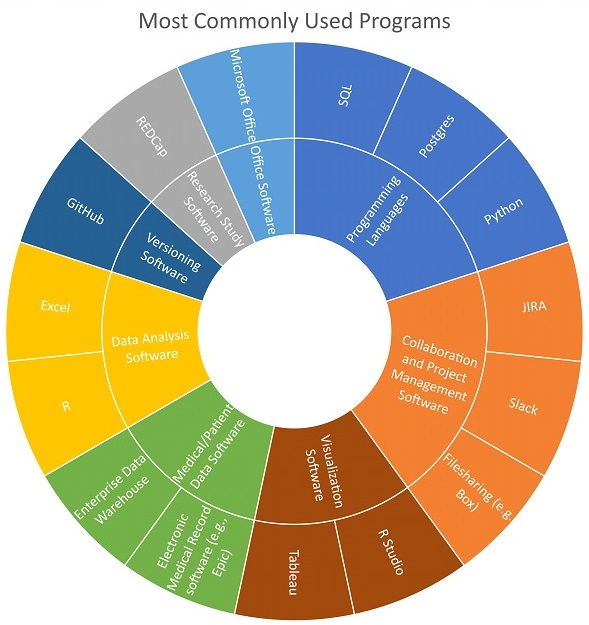

---

### Data Analyst: Jim Blair
#### Profile

<embed src="https://docs.google.com/viewer?url=https://github.com/data2health/CTS-Personas/raw/master/docs/assets/DataAnalyst_PersonaProfile.pdf&embedded=true" style="width:100%; height:700px;" frameborder="0" />
 
Click the icon in the upper right-hand corner, then "Open Original" to download.

#### Software usage

Jim is highly skilled in SQL and SQL server for writing queries to several biomedical databases. He enjoys coding and wants to increase his skills in Python. He is a regular user of Git, R, and Tableau. He frequently queries sources like the local enterprise data warehouse and electronic medical record software, and uses tools such as REDCap, Smartsheet, PowerChart and JIRA to manage his projects. He uses the Microsoft Office Suite for general documentation and communication and uses Lynda.com and Stack Overflow to educate himself on various topics.

##### Back to [Profiles](index.md)
