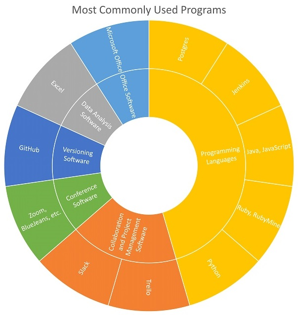

---
### Developer: Eli Daniels
#### Profile

<embed src="https://docs.google.com/viewer?url=https://github.com/data2health/CTS-Personas/raw/master/docs/assets/Developer_PersonaProfile.pdf&embedded=true" style="width:100%; height:700px;" frameborder="0" />
 
Click the icon in the upper right-hand corner, then "Open Original" to download.

#### Software usage

Eli’s skills are in scripts and coding. He is highly experienced in various programming languages including Ruby (mainly using the Rails framework), Python, Java, JavaScript, and associated tools such as Angular, React, DataGrip, RubyMine, Jenkins, and Postgres. He uses GitHub for version control, Trello for project management, and Slack, the Microsoft Office Suite, and video conferencing software for collaboration.

##### Back to [Profiles](index.md)
