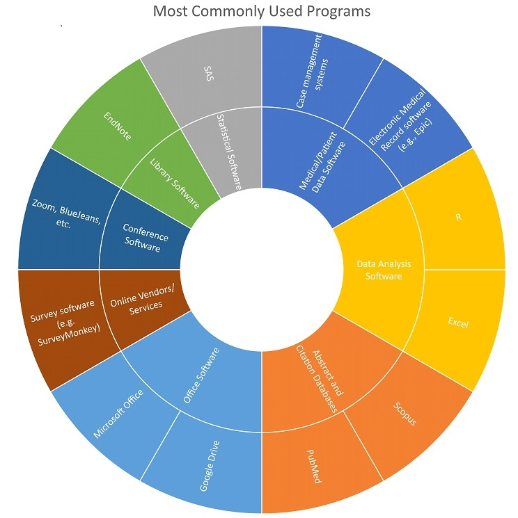

---
### Patient Navigator: Alice Hougen
#### Profile

<embed src="https://docs.google.com/viewer?url=https://github.com/data2health/CTS-Personas/raw/master/docs/assets/PatientNavigator_PersonaProfile.pdf&embedded=true" style="width:100%; height:700px;" frameborder="0" />
 
Click the icon in the upper right-hand corner, then "Open Original" to download.

#### Software usage
Alice is a skilled spreadsheet user. In addition to handling medical appointments, follow-up, and medication logistics for a roster of patients using a plethora of office and web portal-based tools, Alice captures and analyzes patient data using forms, case management systems, online surveys, and program sign-in sheets for demographics. Alice analyzes some data herself using programs like SAS. Her dream is to work directly with IT and administrators to build better systems for navigators and patients in need of navigation services.

##### Back to [Profiles](index.md)
